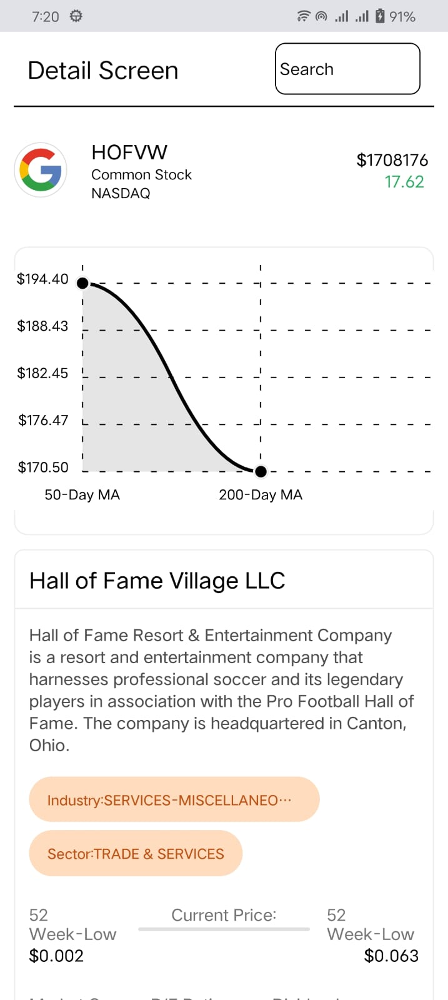
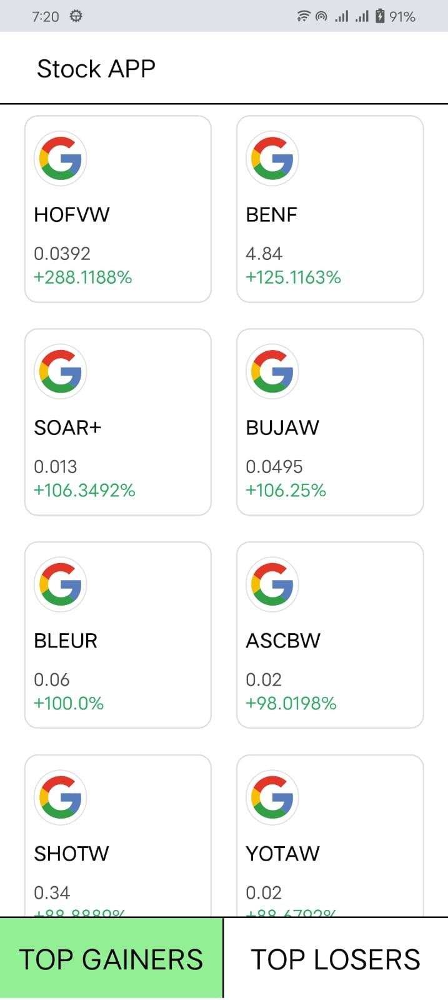

markdown
Copy code
# StockApp

Welcome to **StockApp**, a new [**React Native**](https://reactnative.dev) project, bootstrapped using [`@react-native-community/cli`](https://github.com/react-native-community/cli).

## Table of Contents

- [Getting Started](#getting-started)
  - [Step 1: Start the Metro Server](#step-1-start-the-metro-server)
  - [Step 2: Start your Application](#step-2-start-your-application)
  - [Step 3: Modifying your App](#step-3-modifying-your-app)
- [Screenshots](#screenshots)
- [Congratulations!](#congratulations)
  - [Now what?](#now-what)
- [Troubleshooting](#troubleshooting)
- [Learn More](#learn-more)
- [Get in Touch](#get-in-touch)

## Getting Started

> **Note**: Make sure you have completed the [React Native - Environment Setup](https://reactnative.dev/docs/environment-setup) instructions till the "Creating a new application" step, before proceeding.

### Step 1: Start the Metro Server

First, you will need to start **Metro**, the JavaScript _bundler_ that ships with React Native.

To start Metro, run the following command from the root of your React Native project:

```bash
# using npm
npm start

# OR using Yarn
yarn start
Step 2: Start your Application
Let Metro Bundler run in its own terminal. Open a new terminal from the root of your React Native project. Run the following command to start your Android or iOS app:

For Android
bash
Copy code
# using npm
npm run android

# OR using Yarn
yarn android
For iOS
bash
Copy code
# using npm
npm run ios

# OR using Yarn
yarn ios
If everything is set up correctly, you should see your new app running in your Android Emulator or iOS Simulator shortly, provided you have set up your emulator/simulator correctly.

This is one way to run your app — you can also run it directly from within Android Studio and Xcode respectively.

Step 3: Modifying your App
Now that you have successfully run the app, let's modify it.

Open App.tsx in your text editor of choice and edit some lines.

For Android: Press the <kbd>R</kbd> key twice or select "Reload" from the Developer Menu (<kbd>Ctrl</kbd> + <kbd>M</kbd> (on Windows and Linux) or <kbd>Cmd ⌘</kbd> + <kbd>M</kbd> (on macOS)) to see your changes!

For iOS: Hit <kbd>Cmd ⌘</kbd> + <kbd>R</kbd> in your iOS Simulator to reload the app and see your changes!

Screenshots
Explore Screen
<p float="left">
  
  
</p>

Product Screen

Congratulations! :tada:
You've successfully run and modified your React Native App. :partying_face:

Now what?
If you want to add this new React Native code to an existing application, check out the Integration guide.
If you're curious to learn more about React Native, check out the Introduction to React Native.
Troubleshooting
If you can't get this to work, see the Troubleshooting page.

Learn More
To learn more about React Native, take a look at the following resources:

React Native Website - learn more about React Native.
Getting Started - an overview of React Native and how to set up your environment.
Learn the Basics - a guided tour of the React Native basics.
Blog - read the latest official React Native Blog posts.
@facebook/react-native - the Open Source GitHub repository for React Native.
Get in Touch
📞 Get in Touch

For queries, suggestions, or feedback, drop us a line:

📧 Email: prateekp18012000@gmail.com
🐦 Twitter: @Prateekpatel273

Thank you for checking out StockApp! We hope you enjoy using it as much as we enjoyed building it.

